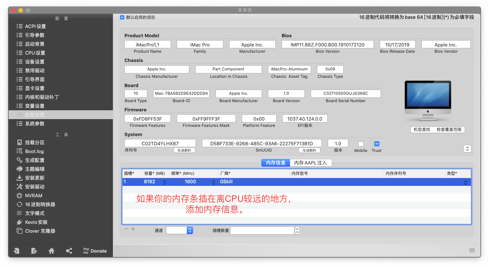
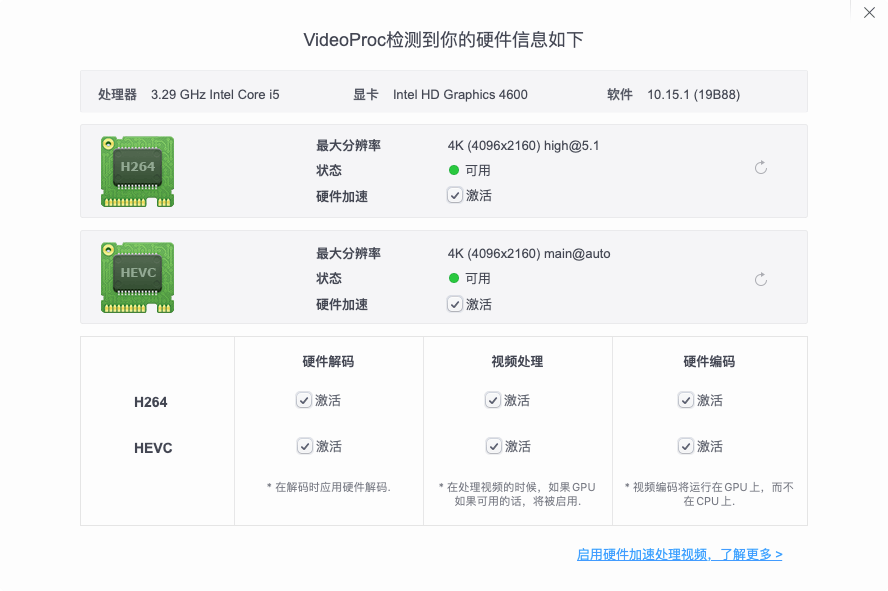
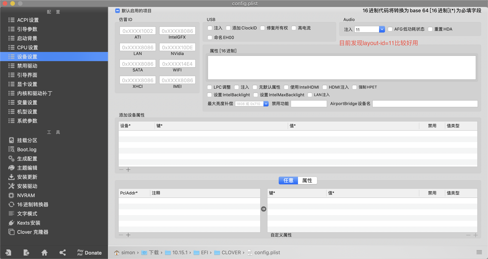

# 我的黑苹果Clover EFI配置
1. 图片加载很慢
2. 250G固态 + 1T机械组融合硬盘用起来很爽，强烈推荐！
3. 在Release页下载EFI

# 主板设置
```
1. 集成外设->Super IO->串口端口A 设置为关闭(10.15.1不关闭休眠后唤醒会死机,10.14.x不会有这个问题)
2. (建议)设置为启动只允许UEFI，因为我只添加了UEFI的驱动
```

# 配置如下

| 项目        | 配置   |
| --------   | :-----  |
| CPU         | 英特尔（Intel）i5-4590 | 
|内存         |芝奇 8G DDR3 1600 x 2|
| 主板        |   技嘉 B85M-D2V(Rev3.0)   | 
| 显卡        |    RX560D-4G白金版(AMD Yes!免驱)    | 
|无线网卡     |无线BCM94360CD蓝牙4.0 (免驱WIFI和蓝牙)|

# 注意事项
1. 最好使用Clover Configurator 5.7或以上版本。我只尝试了10.15.1，我感觉10.14.x应该没问题
   
2. 如果和我的CPU不是同一个，建议如上图设置，再把SSDT文件删除，（EFI->CLOVER->ACPI->patched->SSDT.aml）。这个是CPU变频。可以参考教程[传送门](https://zuiyu1818.cn/posts/Hac_Advanced.html)
   
3. 根据实际情况设置内存信息，如上图。如果你有2根请忽略或者没有卡加号请忽略。
4. 如果可以变量设置、机型设置、系统参数序列号啥都点下生成新的😊
5. 在BIOS中关闭核显(可以不关)
6. 装完把引导参数里-v去掉，这个大家都懂得

# 优点

1. 几乎精简了所有的东西，Clover设置里几乎能去掉的都去掉了，仅仅放了6个核心kext。5个传感器kext不需要可以删除,在EFI->CLOVER->kexts->Other。分别是FakeSMC_ACPISensors.kext、FakeSMC_CPUSensors.kext、FakeSMC_GPUSensors.kext、FakeSMC_LPCSensors.kext、FakeSMC_SMMSensors.kext
2. <del>修改了FakeSMC.kext支持原声电源管理AppleALC。</del>通过dsdt补丁是实现支持原生电源管理
3. 设置机型为iMac Pro1.1，AMD400/500系列支持硬解。听说10.15.2这个福利没有了
4. 可以休眠很赞
5. 支持USB3.0

# 缺点和不足
1. <del>没有好好的弄USB3.0，USB传输最大速度480 Mb/秒,别人都是5 Gb/秒😅。</del>通过SSDT-UIAC.aml文件实现
   
2. 声卡前置和后置不能自动切换，你得自己在系统设置->声音->输入中自己选。有一定的几率开机会没声音(也许是AppleALC.kext驱动的问题，等更新)，重启就好😫。或者自己找一下layout-id [Github连接](https://github.com/acidanthera/AppleALC/wiki/Supported-codecs)，有耐心也可以自己编译声卡驱动，记得给我也发一份
